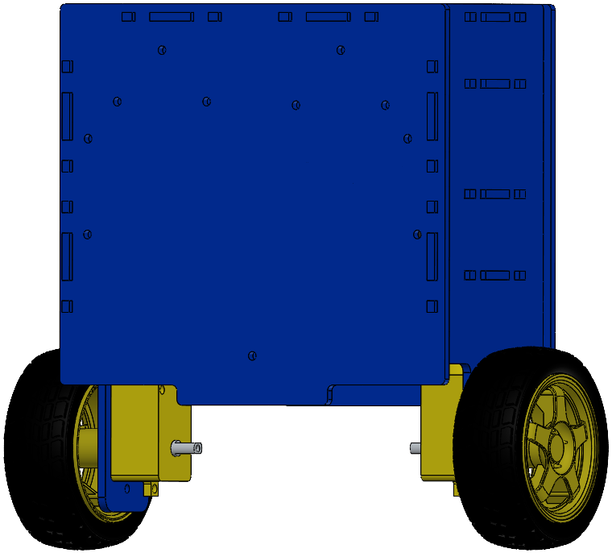

# Two-Wheel Self-Balancing Robot V1

This is a mechanical, electronics and embedded-systems prototype for a 2-wheel self-balancing robot using Arduino UNO, MPU6050 sensor, L298N motor driver, HC-05 Bluetooth module and a laser-cut chassis.

## System Overview

The design combines:

- an **Arduino UNO** as the embedded controller
- an **MPU6050** gyroscope and accelerometer for inertial sensing
- an **L298N** dual H-bridge motor driver
- two geared DC motors and wheels
- an **HC-05 Bluetooth module** for manual-control communication
- a laser-cut multi-level chassis

## Mechanical Design

The native model and manufacturing exports are published on GrabCAD:

- SolidWorks robot model
- Laser-cut DXF
- Bluetooth-holder STL
- Assembly renders

[Open the model on GrabCAD](https://grabcad.com/library/two-wheel-self-balancing-robot-v1-1)

## Electronics

This repository includes the Fritzing schematic, a schematic export, block diagrams, and a mobile-application interaction concept.

## Firmware

The Arduino sketch demonstrates direct I2C communication with the MPU6050, including:

- waking the sensor
- configuring accelerometer and gyroscope ranges
- reading configuration registers
- reading accelerometer, temperature, and gyroscope registers
- reconstructing signed 16-bit sensor values

## Limitations

- V1 focuses on hardware architecture, and mechanical design only.
